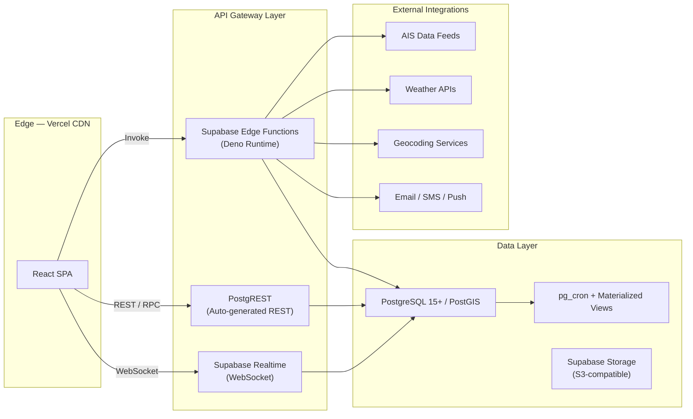
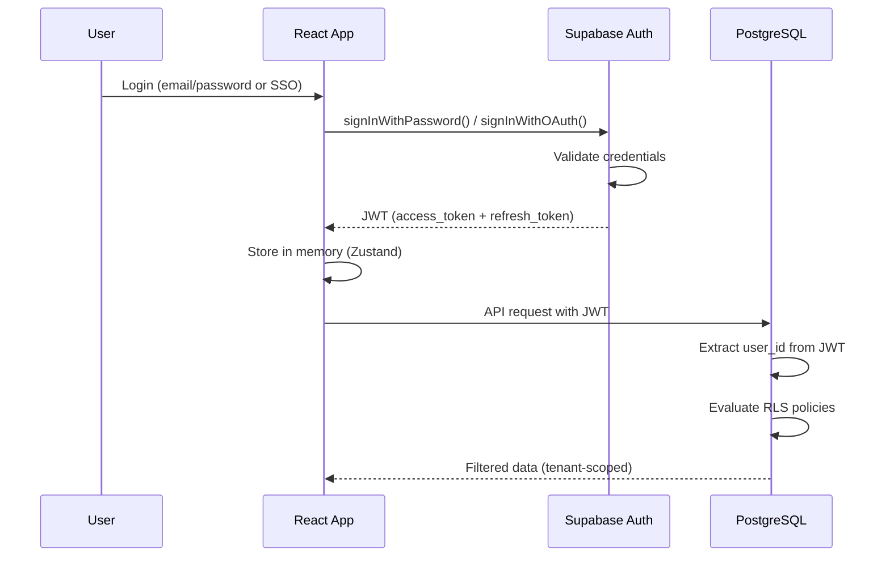
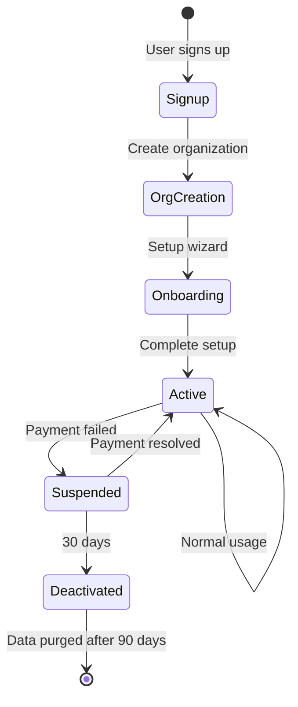

# Part 1 — System & Backend Architecture

---

## 1. High-Level System Architecture

### 1.1 Architecture Style

The platform follows a **modular monolith** pattern on Supabase with clear domain boundaries, designed for future extraction into microservices. The frontend is a single-page application (SPA) deployed on Vercel's edge network.



### 1.2 Core Domains

| Domain | Responsibility | Bounded Context |
|--------|---------------|-----------------|
| **Vessel** | Position tracking, metadata, AIS decoding | `vessel.*` |
| **Fleet** | Fleet grouping, assignments, tagging | `fleet.*` |
| **Voyage** | Route planning, ETA, waypoints, history | `voyage.*` |
| **Alert** | Geofence events, speed alerts, anomalies | `alert.*` |
| **Analytics** | Dashboards, KPIs, reporting | `analytics.*` |
| **Organization** | Tenants, teams, members, billing | `org.*` |
| **Auth** | Authentication, sessions, RBAC | `auth.*` (Supabase built-in + extensions) |
| **Map** | Layers, tiles, geofences, annotations | `map.*` |
| **Integration** | AIS providers, weather, third-party APIs | `integration.*` |
| **Notification** | Email, SMS, push, in-app alerts | `notification.*` |

### 1.3 Request Flow

```
User Action → React Component → Zustand (optimistic update)
    → TanStack Query (mutation) → Supabase Client
        → PostgREST / Edge Function → PostgreSQL
            → RLS Policy Check → Query Execution
                → Response → TanStack Cache Update → UI Re-render

[Parallel] Supabase Realtime → WebSocket → Zustand Store → Map/UI Update
```

---

## 2. Backend Architecture

### 2.1 Supabase Project Layout

```
supabase/
├── migrations/               # Versioned SQL migrations
│   ├── 00001_create_schemas.sql
│   ├── 00002_extensions.sql
│   ├── 00003_org_tables.sql
│   ├── 00004_vessel_tables.sql
│   ├── 00005_fleet_tables.sql
│   ├── 00006_voyage_tables.sql
│   ├── 00007_alert_tables.sql
│   ├── 00008_notification_tables.sql
│   ├── 00009_rls_policies.sql
│   ├── 00010_functions.sql
│   ├── 00011_triggers.sql
│   ├── 00012_indexes.sql
│   ├── 00013_materialized_views.sql
│   └── 00014_seed_data.sql
├── functions/                 # Deno Edge Functions
│   ├── ais-ingest/
│   ├── vessel-search/
│   ├── analytics-aggregate/
│   ├── geofence-check/
│   ├── alert-dispatch/
│   ├── webhook-handler/
│   ├── billing-sync/
│   ├── api-key-validate/
│   └── _shared/              # Shared utilities
│       ├── cors.ts
│       ├── auth.ts
│       ├── response.ts
│       ├── validation.ts
│       └── types.ts
├── seed.sql
└── config.toml
```

### 2.2 PostgreSQL Extensions

```sql
-- Required extensions
CREATE EXTENSION IF NOT EXISTS "uuid-ossp";      -- UUID generation
CREATE EXTENSION IF NOT EXISTS "postgis";         -- Geospatial queries
CREATE EXTENSION IF NOT EXISTS "pg_trgm";         -- Fuzzy text search
CREATE EXTENSION IF NOT EXISTS "btree_gist";      -- GiST indexes
CREATE EXTENSION IF NOT EXISTS "pg_cron";         -- Scheduled jobs
CREATE EXTENSION IF NOT EXISTS "pgcrypto";        -- Encryption
CREATE EXTENSION IF NOT EXISTS "pgjwt";           -- JWT in SQL
```

### 2.3 Schema Isolation (Multi-Tenant)

```sql
-- Schema-per-domain for logical isolation
CREATE SCHEMA IF NOT EXISTS core;          -- Shared types, enums
CREATE SCHEMA IF NOT EXISTS vessel;        -- Vessel domain
CREATE SCHEMA IF NOT EXISTS fleet;         -- Fleet domain
CREATE SCHEMA IF NOT EXISTS voyage;        -- Voyage domain
CREATE SCHEMA IF NOT EXISTS alert;         -- Alert domain
CREATE SCHEMA IF NOT EXISTS analytics;     -- Analytics domain
CREATE SCHEMA IF NOT EXISTS org;           -- Organization domain
CREATE SCHEMA IF NOT EXISTS integration;   -- External integrations
CREATE SCHEMA IF NOT EXISTS notification;  -- Notification domain
CREATE SCHEMA IF NOT EXISTS billing;       -- Subscription & billing
```

---

## 3. Database Architecture

### 3.1 Core Tables (Key Tables Only)

```sql
-- ══════════════════════════════════════
-- ORGANIZATION DOMAIN
-- ══════════════════════════════════════

CREATE TABLE org.organizations (
    id              UUID PRIMARY KEY DEFAULT uuid_generate_v4(),
    name            TEXT NOT NULL,
    slug            TEXT UNIQUE NOT NULL,
    logo_url        TEXT,
    plan_id         UUID REFERENCES billing.plans(id),
    settings        JSONB DEFAULT '{}',
    metadata        JSONB DEFAULT '{}',
    is_active       BOOLEAN DEFAULT true,
    created_at      TIMESTAMPTZ DEFAULT now(),
    updated_at      TIMESTAMPTZ DEFAULT now()
);

CREATE TABLE org.members (
    id              UUID PRIMARY KEY DEFAULT uuid_generate_v4(),
    org_id          UUID NOT NULL REFERENCES org.organizations(id) ON DELETE CASCADE,
    user_id         UUID NOT NULL REFERENCES auth.users(id) ON DELETE CASCADE,
    role            TEXT NOT NULL DEFAULT 'viewer',  -- owner | admin | operator | analyst | viewer
    team_ids        UUID[] DEFAULT '{}',
    permissions     JSONB DEFAULT '{}',              -- permission overrides
    invited_by      UUID REFERENCES auth.users(id),
    joined_at       TIMESTAMPTZ DEFAULT now(),
    UNIQUE(org_id, user_id)
);

CREATE TABLE org.teams (
    id              UUID PRIMARY KEY DEFAULT uuid_generate_v4(),
    org_id          UUID NOT NULL REFERENCES org.organizations(id) ON DELETE CASCADE,
    name            TEXT NOT NULL,
    description     TEXT,
    created_at      TIMESTAMPTZ DEFAULT now()
);

-- ══════════════════════════════════════
-- VESSEL DOMAIN
-- ══════════════════════════════════════

CREATE TABLE vessel.vessels (
    id              UUID PRIMARY KEY DEFAULT uuid_generate_v4(),
    org_id          UUID NOT NULL REFERENCES org.organizations(id),
    mmsi            TEXT UNIQUE,
    imo             TEXT UNIQUE,
    name            TEXT NOT NULL,
    call_sign       TEXT,
    flag_country    TEXT,
    vessel_type     TEXT,
    gross_tonnage   NUMERIC,
    deadweight      NUMERIC,
    length_overall  NUMERIC,
    beam            NUMERIC,
    year_built      INTEGER,
    status          TEXT DEFAULT 'active',
    metadata        JSONB DEFAULT '{}',
    created_at      TIMESTAMPTZ DEFAULT now(),
    updated_at      TIMESTAMPTZ DEFAULT now()
);

CREATE TABLE vessel.positions (
    id              UUID PRIMARY KEY DEFAULT uuid_generate_v4(),
    vessel_id       UUID NOT NULL REFERENCES vessel.vessels(id) ON DELETE CASCADE,
    org_id          UUID NOT NULL,
    location        GEOGRAPHY(POINT, 4326) NOT NULL,  -- PostGIS point
    heading         NUMERIC,
    course          NUMERIC,
    speed           NUMERIC,                           -- knots
    nav_status      TEXT,
    rot             NUMERIC,                           -- rate of turn
    timestamp       TIMESTAMPTZ NOT NULL,
    source          TEXT DEFAULT 'ais',                 -- ais | manual | api
    raw_data        JSONB,
    created_at      TIMESTAMPTZ DEFAULT now()
);

-- Hypertable-style partitioning for positions (time-based)
CREATE INDEX idx_positions_vessel_time ON vessel.positions (vessel_id, timestamp DESC);
CREATE INDEX idx_positions_location ON vessel.positions USING GIST (location);
CREATE INDEX idx_positions_org ON vessel.positions (org_id, timestamp DESC);

-- Latest position materialized view
CREATE MATERIALIZED VIEW vessel.latest_positions AS
SELECT DISTINCT ON (vessel_id)
    vessel_id, org_id, location, heading, course, speed,
    nav_status, timestamp, source
FROM vessel.positions
ORDER BY vessel_id, timestamp DESC;

CREATE UNIQUE INDEX idx_latest_pos_vessel ON vessel.latest_positions (vessel_id);

-- ══════════════════════════════════════
-- FLEET DOMAIN
-- ══════════════════════════════════════

CREATE TABLE fleet.fleets (
    id              UUID PRIMARY KEY DEFAULT uuid_generate_v4(),
    org_id          UUID NOT NULL REFERENCES org.organizations(id),
    name            TEXT NOT NULL,
    description     TEXT,
    color           TEXT,
    icon            TEXT,
    created_at      TIMESTAMPTZ DEFAULT now()
);

CREATE TABLE fleet.fleet_vessels (
    fleet_id        UUID REFERENCES fleet.fleets(id) ON DELETE CASCADE,
    vessel_id       UUID REFERENCES vessel.vessels(id) ON DELETE CASCADE,
    added_at        TIMESTAMPTZ DEFAULT now(),
    PRIMARY KEY (fleet_id, vessel_id)
);

-- ══════════════════════════════════════
-- ALERT DOMAIN
-- ══════════════════════════════════════

CREATE TABLE alert.rules (
    id              UUID PRIMARY KEY DEFAULT uuid_generate_v4(),
    org_id          UUID NOT NULL REFERENCES org.organizations(id),
    name            TEXT NOT NULL,
    type            TEXT NOT NULL,  -- geofence_entry | geofence_exit | speed | proximity | zone | ais_gap
    config          JSONB NOT NULL, -- rule-specific configuration
    severity        TEXT DEFAULT 'info',  -- critical | warning | info
    is_active       BOOLEAN DEFAULT true,
    vessel_ids      UUID[],        -- null = all vessels
    fleet_ids       UUID[],
    notify_channels TEXT[] DEFAULT '{in_app}',
    created_by      UUID REFERENCES auth.users(id),
    created_at      TIMESTAMPTZ DEFAULT now()
);

CREATE TABLE alert.events (
    id              UUID PRIMARY KEY DEFAULT uuid_generate_v4(),
    org_id          UUID NOT NULL,
    rule_id         UUID REFERENCES alert.rules(id),
    vessel_id       UUID REFERENCES vessel.vessels(id),
    type            TEXT NOT NULL,
    severity        TEXT NOT NULL,
    title           TEXT NOT NULL,
    description     TEXT,
    location        GEOGRAPHY(POINT, 4326),
    data            JSONB,
    acknowledged    BOOLEAN DEFAULT false,
    acknowledged_by UUID REFERENCES auth.users(id),
    acknowledged_at TIMESTAMPTZ,
    created_at      TIMESTAMPTZ DEFAULT now()
);

-- ══════════════════════════════════════
-- VOYAGE DOMAIN
-- ══════════════════════════════════════

CREATE TABLE voyage.voyages (
    id              UUID PRIMARY KEY DEFAULT uuid_generate_v4(),
    org_id          UUID NOT NULL,
    vessel_id       UUID NOT NULL REFERENCES vessel.vessels(id),
    name            TEXT,
    origin_port     TEXT,
    origin_location GEOGRAPHY(POINT, 4326),
    dest_port       TEXT,
    dest_location   GEOGRAPHY(POINT, 4326),
    departure_time  TIMESTAMPTZ,
    eta             TIMESTAMPTZ,
    ata             TIMESTAMPTZ,      -- actual time of arrival
    status          TEXT DEFAULT 'planned', -- planned | active | completed | cancelled
    route           GEOGRAPHY(LINESTRING, 4326),
    distance_nm     NUMERIC,
    metadata        JSONB DEFAULT '{}',
    created_at      TIMESTAMPTZ DEFAULT now()
);

-- ══════════════════════════════════════
-- MAP / GEOFENCE DOMAIN
-- ══════════════════════════════════════

CREATE TABLE alert.geofences (
    id              UUID PRIMARY KEY DEFAULT uuid_generate_v4(),
    org_id          UUID NOT NULL REFERENCES org.organizations(id),
    name            TEXT NOT NULL,
    description     TEXT,
    geometry        GEOGRAPHY(POLYGON, 4326) NOT NULL,
    type            TEXT DEFAULT 'custom', -- port | anchorage | eca | custom | restricted
    color           TEXT DEFAULT '#3B82F6',
    is_active       BOOLEAN DEFAULT true,
    metadata        JSONB DEFAULT '{}',
    created_at      TIMESTAMPTZ DEFAULT now()
);

CREATE INDEX idx_geofences_geo ON alert.geofences USING GIST (geometry);
```

### 3.2 Refresh Strategy for Materialized Views

```sql
-- pg_cron job: refresh latest positions every 30 seconds
SELECT cron.schedule(
    'refresh-latest-positions',
    '30 seconds',
    'REFRESH MATERIALIZED VIEW CONCURRENTLY vessel.latest_positions'
);

-- pg_cron job: aggregate analytics daily
SELECT cron.schedule(
    'daily-analytics',
    '0 2 * * *',
    'SELECT analytics.run_daily_aggregation()'
);
```

---

## 4. API Architecture

### 4.1 API Layers

| Layer | Technology | Use Case |
|-------|-----------|----------|
| **Auto-REST** | PostgREST via Supabase | CRUD on all tables with RLS |
| **RPC** | `supabase.rpc()` | Complex queries, aggregations, search |
| **Edge Functions** | Deno runtime | External integrations, webhooks, heavy compute |
| **Realtime** | WebSocket | Live position updates, alerts, presence |
| **Public API** | Edge Functions + API keys | Enterprise API for external consumers |

### 4.2 Edge Function Patterns

```
Edge Function Request Flow:
─────────────────────────────
Request → CORS Check → Auth Validation → Rate Limiting
    → Input Validation (Zod) → Business Logic
        → Database Query → Response Formatting → Response

Error Flow:
    → Catch → Structured Error Response { code, message, details }
```

### 4.3 Public Enterprise API (v1)

```
Base URL: https://api.marinetrack.io/v1

Authentication: Bearer <api_key> or X-API-Key header

Endpoints:
  GET    /vessels                  — List vessels (paginated, filtered)
  GET    /vessels/:id              — Vessel details
  GET    /vessels/:id/positions    — Position history (time range)
  GET    /vessels/:id/track        — Track as GeoJSON LineString
  GET    /vessels/search           — Search by name, MMSI, IMO
  GET    /vessels/area             — Vessels in bounding box

  GET    /fleets                   — List fleets
  GET    /fleets/:id/vessels       — Fleet vessels with positions

  GET    /voyages                  — List voyages
  GET    /voyages/:id              — Voyage details with route

  GET    /alerts                   — List alert events
  POST   /alerts/rules             — Create alert rule

  GET    /geofences                — List geofences
  POST   /geofences                — Create geofence

  WebSocket /realtime              — Subscribe to position stream

Rate Limits (by plan):
  Starter:    100 req/min, 10K req/day
  Pro:        500 req/min, 100K req/day
  Enterprise: 2000 req/min, unlimited
```

---

## 5. Authentication Architecture

### 5.1 Auth Flow



### 5.2 JWT Claims Extension

```sql
-- Custom JWT hook to inject org_id and role into token
CREATE OR REPLACE FUNCTION auth.custom_access_token_hook(event JSONB)
RETURNS JSONB AS $$
DECLARE
    claims JSONB;
    member_record RECORD;
BEGIN
    claims := event->'claims';

    SELECT org_id, role INTO member_record
    FROM org.members
    WHERE user_id = (event->>'user_id')::UUID
    LIMIT 1;

    IF member_record IS NOT NULL THEN
        claims := jsonb_set(claims, '{org_id}', to_jsonb(member_record.org_id));
        claims := jsonb_set(claims, '{org_role}', to_jsonb(member_record.role));
    END IF;

    event := jsonb_set(event, '{claims}', claims);
    RETURN event;
END;
$$ LANGUAGE plpgsql;
```

### 5.3 Session Management

- **Access tokens**: 15-minute expiry, stored in memory only
- **Refresh tokens**: 7-day expiry, httpOnly cookie
- **Auto-refresh**: Supabase client handles token rotation
- **Multi-tab sync**: `BroadcastChannel` API for cross-tab session sync
- **SSO**: Support SAML 2.0 / OIDC for enterprise customers (Supabase Auth supports this natively)

---

## 6. RBAC & Permissions Architecture

### 6.1 Role Hierarchy

```
owner          — Full control, billing, delete org
  └── admin    — Manage members, settings, all data
      └── operator  — CRUD vessels, fleets, voyages, alerts
          └── analyst   — Read all, create reports/dashboards
              └── viewer    — Read-only access
```

### 6.2 Permission Matrix

| Resource | Owner | Admin | Operator | Analyst | Viewer |
|----------|:-----:|:-----:|:--------:|:-------:|:------:|
| Org settings | ✅ | ✅ | ❌ | ❌ | ❌ |
| Billing | ✅ | ❌ | ❌ | ❌ | ❌ |
| Members | ✅ | ✅ | ❌ | ❌ | ❌ |
| Vessels (write) | ✅ | ✅ | ✅ | ❌ | ❌ |
| Vessels (read) | ✅ | ✅ | ✅ | ✅ | ✅ |
| Fleets (write) | ✅ | ✅ | ✅ | ❌ | ❌ |
| Alerts (write) | ✅ | ✅ | ✅ | ❌ | ❌ |
| Alerts (ack) | ✅ | ✅ | ✅ | ✅ | ❌ |
| Geofences | ✅ | ✅ | ✅ | ❌ | ❌ |
| Analytics | ✅ | ✅ | ✅ | ✅ | ✅ |
| API keys | ✅ | ✅ | ❌ | ❌ | ❌ |
| Export | ✅ | ✅ | ✅ | ✅ | ❌ |

### 6.3 RLS Policy Pattern

```sql
-- Helper function: get current user's org_id from JWT
CREATE OR REPLACE FUNCTION auth.org_id() RETURNS UUID AS $$
    SELECT (current_setting('request.jwt.claims', true)::JSONB ->> 'org_id')::UUID;
$$ LANGUAGE sql STABLE;

-- Helper function: get current user's role
CREATE OR REPLACE FUNCTION auth.org_role() RETURNS TEXT AS $$
    SELECT current_setting('request.jwt.claims', true)::JSONB ->> 'org_role';
$$ LANGUAGE sql STABLE;

-- RLS on vessels: tenant isolation
ALTER TABLE vessel.vessels ENABLE ROW LEVEL SECURITY;

CREATE POLICY "tenant_isolation" ON vessel.vessels
    FOR ALL
    USING (org_id = auth.org_id());

CREATE POLICY "operators_can_insert" ON vessel.vessels
    FOR INSERT
    WITH CHECK (
        org_id = auth.org_id()
        AND auth.org_role() IN ('owner', 'admin', 'operator')
    );

CREATE POLICY "operators_can_update" ON vessel.vessels
    FOR UPDATE
    USING (
        org_id = auth.org_id()
        AND auth.org_role() IN ('owner', 'admin', 'operator')
    );

CREATE POLICY "admins_can_delete" ON vessel.vessels
    FOR DELETE
    USING (
        org_id = auth.org_id()
        AND auth.org_role() IN ('owner', 'admin')
    );
```

---

## 7. Multi-Tenant Organization Architecture

### 7.1 Tenancy Model

**Approach: Shared database, shared schema, row-level isolation.**

Every table with tenant-scoped data contains an `org_id` column. RLS policies enforce that users can only access rows matching their JWT `org_id` claim. This approach:

- ✅ Cost-efficient (single DB)
- ✅ Simple operations (one migration for all tenants)
- ✅ Supabase-native (RLS is first-class)
- ⚠️ Requires disciplined RLS policy coverage

### 7.2 Organization Lifecycle



### 7.3 Invitation Flow

```
Admin → Invite member (email + role) → Edge Function
    → Generate invite token → Store in org.invitations
    → Send email with magic link
    → Invitee clicks link → Supabase Auth (signup/login)
    → Custom hook checks invitation token
    → Creates org.members record → Redirect to dashboard
```

---

## 8. Billing Architecture

### 8.1 Plan Tiers

| Feature | Free | Starter | Pro | Enterprise |
|---------|:----:|:-------:|:---:|:----------:|
| Vessels | 5 | 50 | 500 | Unlimited |
| Users | 2 | 10 | 50 | Unlimited |
| History | 7d | 30d | 1yr | Unlimited |
| Refresh rate | 5min | 1min | 15s | 5s |
| Geofences | 3 | 25 | 100 | Unlimited |
| API access | ❌ | Basic | Full | Full + SLA |
| SSO | ❌ | ❌ | ❌ | ✅ |
| Support | Community | Email | Priority | Dedicated |

### 8.2 Enforcement Pattern

```sql
-- Function to check plan limits
CREATE OR REPLACE FUNCTION billing.check_vessel_limit()
RETURNS TRIGGER AS $$
DECLARE
    current_count INTEGER;
    max_allowed INTEGER;
BEGIN
    SELECT COUNT(*) INTO current_count
    FROM vessel.vessels WHERE org_id = NEW.org_id;

    SELECT (p.limits->>'max_vessels')::INTEGER INTO max_allowed
    FROM org.organizations o
    JOIN billing.plans p ON p.id = o.plan_id
    WHERE o.id = NEW.org_id;

    IF current_count >= max_allowed THEN
        RAISE EXCEPTION 'Vessel limit reached for current plan';
    END IF;

    RETURN NEW;
END;
$$ LANGUAGE plpgsql;
```
