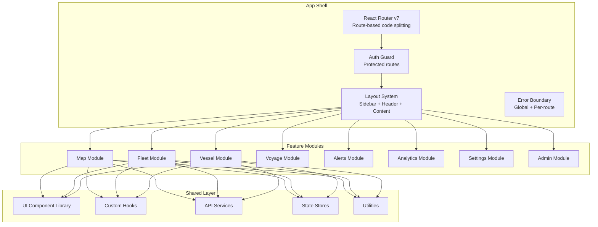
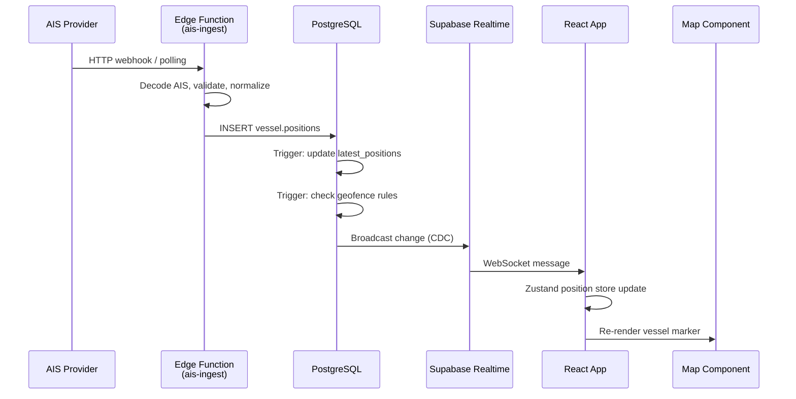

# Part 2 — Frontend, Realtime & Map Architecture

---

## 9. Enterprise Frontend Architecture

### 9.1 Application Shell



### 9.2 Route Architecture

```typescript
// Route hierarchy
/                           → Redirect to /dashboard or /login
/login                      → Public: Login page
/signup                     → Public: Signup + org creation
/invite/:token              → Public: Accept invitation
/forgot-password            → Public: Password reset

/app                        → Protected: App shell layout
  /app/dashboard            → Dashboard overview
  /app/map                  → Full-screen live map
  /app/map/vessel/:id       → Map focused on vessel
  /app/vessels              → Vessel list
  /app/vessels/:id          → Vessel detail page
  /app/vessels/:id/history  → Vessel track history
  /app/fleets               → Fleet management
  /app/fleets/:id           → Fleet detail
  /app/voyages              → Voyage list
  /app/voyages/:id          → Voyage detail + route
  /app/alerts               → Alert rules & events
  /app/alerts/:id           → Alert detail
  /app/analytics            → Analytics dashboard
  /app/analytics/reports    → Report builder
  /app/geofences            → Geofence manager
  /app/settings             → Org settings
  /app/settings/members     → Team management
  /app/settings/billing     → Subscription & billing
  /app/settings/api-keys    → API key management
  /app/settings/profile     → User profile
```

### 9.3 Component Architecture Patterns

```
Component Organization (per feature):
──────────────────────────────────────
features/
  vessels/
    components/           — Feature-specific components
      VesselCard.tsx
      VesselTable.tsx
      VesselFilters.tsx
    hooks/                — Feature-specific hooks
      useVessels.ts
      useVesselDetail.ts
      useVesselSearch.ts
    services/             — API layer
      vessel.service.ts
      vessel.types.ts
    stores/               — Feature state
      vessel.store.ts
    utils/                — Feature utilities
      vessel.helpers.ts
    pages/                — Route pages
      VesselsPage.tsx
      VesselDetailPage.tsx
    index.ts              — Public API barrel export
```

**Component Design Rules:**
1. **Container/Presentational split**: Pages are containers; components are presentational
2. **Co-location**: Keep related files together within features
3. **Barrel exports**: Each feature exposes a clean public API via `index.ts`
4. **No cross-feature imports**: Features communicate through shared stores or URL params
5. **Composition over inheritance**: Use compound components and render props

---

## 10. State Management Architecture

### 10.1 State Categorization

| Category | Tool | Example |
|----------|------|---------|
| **Server state** | TanStack Query | Vessel list, fleet data, alert events |
| **Realtime state** | Zustand + Supabase Realtime | Live vessel positions, presence |
| **Client UI state** | Zustand | Sidebar open, selected vessel, map viewport |
| **Form state** | React Hook Form + Zod | Create vessel, edit geofence |
| **URL state** | React Router (searchParams) | Filters, pagination, vessel focus |

### 10.2 Zustand Store Architecture

```typescript
// Store slices (composed into bounded stores, NOT one global store)

// ── Map Store ──────────────────────────────
interface MapStore {
  viewport: MapViewport;
  selectedVesselId: string | null;
  activeLayers: Set<string>;
  clusteringEnabled: boolean;
  actions: {
    setViewport: (vp: MapViewport) => void;
    selectVessel: (id: string | null) => void;
    toggleLayer: (layerId: string) => void;
    flyTo: (coords: [number, number], zoom?: number) => void;
  };
}

// ── Realtime Positions Store ───────────────
interface PositionStore {
  positions: Map<string, VesselPosition>;   // vesselId → latest position
  tracks: Map<string, VesselPosition[]>;    // vesselId → position history
  connectionStatus: 'connected' | 'reconnecting' | 'disconnected';
  actions: {
    upsertPosition: (pos: VesselPosition) => void;
    appendTrack: (vesselId: string, pos: VesselPosition) => void;
    clearTracks: () => void;
  };
}

// ── Alert Store ────────────────────────────
interface AlertStore {
  unreadCount: number;
  recentAlerts: AlertEvent[];
  actions: {
    addAlert: (alert: AlertEvent) => void;
    markRead: (id: string) => void;
    markAllRead: () => void;
  };
}

// ── UI Store ───────────────────────────────
interface UIStore {
  sidebarCollapsed: boolean;
  commandPaletteOpen: boolean;
  theme: 'dark' | 'light' | 'system';
  actions: {
    toggleSidebar: () => void;
    toggleCommandPalette: () => void;
    setTheme: (theme: string) => void;
  };
}
```

### 10.3 TanStack Query Patterns

```typescript
// Query key factory pattern for consistency
export const vesselKeys = {
  all:        ['vessels'] as const,
  lists:      () => [...vesselKeys.all, 'list'] as const,
  list:       (filters: VesselFilters) => [...vesselKeys.lists(), filters] as const,
  details:    () => [...vesselKeys.all, 'detail'] as const,
  detail:     (id: string) => [...vesselKeys.details(), id] as const,
  positions:  (id: string) => [...vesselKeys.detail(id), 'positions'] as const,
  search:     (query: string) => [...vesselKeys.all, 'search', query] as const,
};

// Optimistic update pattern
const useUpdateVessel = () => {
  const queryClient = useQueryClient();

  return useMutation({
    mutationFn: vesselService.update,
    onMutate: async (updated) => {
      await queryClient.cancelQueries({ queryKey: vesselKeys.detail(updated.id) });
      const previous = queryClient.getQueryData(vesselKeys.detail(updated.id));
      queryClient.setQueryData(vesselKeys.detail(updated.id), updated);
      return { previous };
    },
    onError: (_err, _vars, context) => {
      queryClient.setQueryData(vesselKeys.detail(_vars.id), context?.previous);
    },
    onSettled: (_data, _err, vars) => {
      queryClient.invalidateQueries({ queryKey: vesselKeys.detail(vars.id) });
    },
  });
};
```

---

## 11. Map Architecture (Mapbox GL JS)

### 11.1 Map Layer Stack

```
Layer Rendering Order (bottom to top):
═══════════════════════════════════════
1. Base Map           — Mapbox dark/satellite style
2. Weather Overlay    — Wind, waves, currents (optional)
3. ECA Zones          — Emission Control Areas
4. Geofences          — User-defined polygons
5. Port Markers       — Major ports
6. Voyage Routes      — Planned routes (dashed lines)
7. Vessel Tracks      — Historical trails (gradient lines)
8. Vessel Clusters    — Clustered markers (at low zoom)
9. Vessel Markers     — Individual vessel icons (at high zoom)
10. Selected Vessel   — Highlighted vessel with info popup
11. Drawing Layer     — Geofence drawing tools
```

### 11.2 Map Component Architecture

```typescript
// Map module structure
features/map/
  components/
    MapContainer.tsx            — Main map wrapper, lifecycle
    MapControls.tsx             — Zoom, compass, fullscreen, style switcher
    MapLayerManager.tsx         — Layer toggle panel
    VesselMarkerLayer.tsx       — Renders vessel icons on map
    VesselClusterLayer.tsx      — Cluster logic at low zoom
    VesselTrackLayer.tsx        — Historical track rendering
    GeofenceLayer.tsx           — Polygon overlay rendering
    GeofenceDrawer.tsx          — Draw/edit geofences
    VoyageRouteLayer.tsx        — Route line rendering
    WeatherOverlay.tsx          — Weather tile overlay
    PortMarkerLayer.tsx         — Port icons
    VesselPopup.tsx             — Hover/click popup card
    MiniMap.tsx                 — Overview minimap (vessel detail)
  hooks/
    useMap.ts                   — Map instance management
    useMapViewport.ts           — Viewport sync with store
    useVesselLayer.ts           — Vessel source/layer management
    useCluster.ts               — Supercluster integration
    useGeofenceDraw.ts          — Mapbox Draw integration
    useMapInteraction.ts        — Click/hover handlers
  utils/
    map.config.ts               — Default styles, tokens
    geo.helpers.ts              — GeoJSON utilities
    vessel-icon.generator.ts    — Dynamic vessel SVG icons
    viewport.helpers.ts         — Bounds, zoom calculations
  stores/
    map.store.ts                — Viewport, layers, selection
```

### 11.3 Vessel Rendering Strategy

```
Zoom Level Strategy:
────────────────────
Zoom 0-4:    Heatmap density (global overview)
Zoom 5-8:    Clustered markers with count badges
Zoom 9-12:   Individual vessel icons (simplified)
Zoom 13+:    Detailed vessel icons with heading arrow + name label

Icon Generation:
────────────────
Each vessel type has a distinct icon shape (cargo, tanker, passenger, fishing, etc.)
Icons are rotated to match vessel heading.
Color encodes status: green=underway, yellow=anchored, red=alert, gray=inactive.
Icons are generated as SVGs and rasterized to canvas for Mapbox image source.
```

### 11.4 Performance Optimizations for Map

| Technique | Description |
|-----------|-------------|
| **Web Workers** | Cluster computation offloaded via Supercluster in a Worker |
| **Viewport culling** | Only render vessels within current viewport bounds |
| **Debounced updates** | Batch position updates every 500ms to avoid layout thrashing |
| **Icon atlas** | Pre-generate icon texture atlas for all vessel types |
| **GeoJSON diff** | Only update changed positions in the source, not full replacement |
| **requestAnimationFrame** | Sync marker animations with browser paint cycle |
| **Lazy layers** | Weather / port layers loaded only when toggled on |

---

## 12. Realtime & WebSocket Architecture

### 12.1 Realtime Data Flow



### 12.2 Supabase Realtime Channels

```typescript
// Channel architecture
const channels = {
  // Channel 1: Live vessel positions for org
  positions: supabase.channel(`positions:${orgId}`)
    .on('postgres_changes', {
      event: 'INSERT',
      schema: 'vessel',
      table: 'positions',
      filter: `org_id=eq.${orgId}`,
    }, handlePositionUpdate)
    .subscribe(),

  // Channel 2: Alert events for org
  alerts: supabase.channel(`alerts:${orgId}`)
    .on('postgres_changes', {
      event: 'INSERT',
      schema: 'alert',
      table: 'events',
      filter: `org_id=eq.${orgId}`,
    }, handleNewAlert)
    .subscribe(),

  // Channel 3: Presence (who's viewing what)
  presence: supabase.channel(`presence:${orgId}`)
    .on('presence', { event: 'sync' }, handlePresenceSync)
    .on('presence', { event: 'join' }, handlePresenceJoin)
    .on('presence', { event: 'leave' }, handlePresenceLeave)
    .subscribe(async (status) => {
      if (status === 'SUBSCRIBED') {
        await channel.track({ userId, viewingVesselId, online_at: new Date() });
      }
    }),

  // Channel 4: Broadcast for collaborative features
  broadcast: supabase.channel(`collab:${orgId}`)
    .on('broadcast', { event: 'cursor_move' }, handleCursorMove)
    .on('broadcast', { event: 'viewport_share' }, handleViewportShare)
    .subscribe(),
};
```

### 12.3 Connection Resilience

```
Reconnection Strategy:
──────────────────────
1. Detect disconnect → update connectionStatus in store
2. Show banner: "Reconnecting to live feed..."
3. Exponential backoff: 1s → 2s → 4s → 8s → 16s → 30s (max)
4. On reconnect:
   a. Re-subscribe to all channels
   b. Fetch missed positions since last timestamp (gap fill)
   c. Reconcile with current store state
   d. Hide banner
5. After 5 failed attempts: show "Connection lost" with manual retry button
6. On tab visibility change (hidden → visible):
   a. Check connection health
   b. Gap-fill any missed data
```

---

## 13. AIS-Ready Architecture

### 13.1 AIS Data Pipeline

```
AIS Message Types Supported:
────────────────────────────
Type 1/2/3:   Position Report (Class A)
Type 5:       Static & Voyage Data
Type 18:      Position Report (Class B)
Type 21:      Aid-to-Navigation
Type 24:      Class B Static Data

Ingestion Pipeline:
───────────────────
AIS Provider (API/WebSocket)
    ↓
Edge Function: ais-ingest
    ├── Decode NMEA/JSON payload
    ├── Validate MMSI, coordinates
    ├── Normalize to internal schema
    ├── Deduplicate (skip if <10s since last from same MMSI)
    ├── Enrich (vessel lookup, flag, type)
    ├── INSERT into vessel.positions
    ├── UPSERT vessel.vessels (if Type 5 static data)
    └── Emit to Realtime channel

Rate: designed for 100K+ messages/minute at enterprise scale
```

### 13.2 AIS Provider Abstraction

```typescript
// Provider interface — swap providers without changing pipeline
interface AISProvider {
  name: string;
  connect(): Promise<void>;
  disconnect(): Promise<void>;
  onMessage(handler: (msg: RawAISMessage) => void): void;
  getHistoricalTrack(mmsi: string, from: Date, to: Date): Promise<AISPosition[]>;
}

// Implementations:
// - MarineTrafficProvider
// - VesselFinderProvider
// - SpireProvider
// - BarentsWatchProvider
// - CustomAISReceiverProvider (self-hosted AIS antenna)
```

---

## 14. Caching Architecture

### 14.1 Multi-Level Cache Strategy

```
Level 1: Browser Memory (Zustand stores)
─────────────────────────────────────────
- Live vessel positions (Map<vesselId, position>)
- User preferences, UI state
- TTL: session lifetime
- Eviction: LRU on position history (max 1000 points per vessel)

Level 2: TanStack Query Cache
─────────────────────────────
- Server data (vessel lists, fleet data, analytics)
- Configurable staleTime per query type:
    Vessel list:       30 seconds
    Vessel detail:     60 seconds
    Fleet data:        60 seconds
    Analytics:         5 minutes
    Org settings:      10 minutes
    Static data:       1 hour
- Background refetch on window focus
- Automatic garbage collection (gcTime: 10 minutes)

Level 3: Service Worker (future)
────────────────────────────────
- Offline support for vessel metadata
- Cached map tiles
- Precached app shell (PWA)

Level 4: PostgreSQL Materialized Views
──────────────────────────────────────
- vessel.latest_positions — refreshed every 30s
- analytics.daily_summary — refreshed nightly
- analytics.fleet_stats — refreshed hourly

Level 5: CDN (Vercel Edge)
──────────────────────────
- Static assets (immutable hashing)
- API responses with Cache-Control headers
- Map tile proxy caching
```

### 14.2 Cache Invalidation Strategy

```
Event-Driven Invalidation:
─────────────────────────
Supabase Realtime change event
    → Zustand store update (immediate, for realtime data)
    → TanStack Query invalidation (for related queries)

Example: New position arrives
    → positionStore.upsertPosition(pos)          // L1: immediate
    → queryClient.invalidateQueries(['vessels'])  // L2: refetch list
    → No action needed for L3-L5                  // stale-while-revalidate

Example: Vessel deleted
    → queryClient.removeQueries(vesselKeys.detail(id))  // L2: remove
    → queryClient.invalidateQueries(vesselKeys.lists())  // L2: refetch
    → positionStore.removeVessel(id)                     // L1: cleanup
```

---

## 15. Event-Driven Architecture

### 15.1 Database Trigger Events

```sql
-- Event: New position inserted → check geofences
CREATE OR REPLACE FUNCTION alert.check_geofence_on_position()
RETURNS TRIGGER AS $$
DECLARE
    fence RECORD;
BEGIN
    FOR fence IN
        SELECT g.id, g.name, g.type,
            ST_Contains(g.geometry::geometry, NEW.location::geometry) AS inside
        FROM alert.geofences g
        JOIN alert.rules r ON r.config->>'geofence_id' = g.id::text
        WHERE g.org_id = NEW.org_id
        AND g.is_active = true
        AND r.is_active = true
        AND (r.vessel_ids IS NULL OR NEW.vessel_id = ANY(r.vessel_ids))
    LOOP
        -- Check if vessel entered or exited geofence
        -- Compare with previous position
        -- If state changed, INSERT into alert.events
    END LOOP;
    RETURN NEW;
END;
$$ LANGUAGE plpgsql;

CREATE TRIGGER trg_geofence_check
AFTER INSERT ON vessel.positions
FOR EACH ROW
EXECUTE FUNCTION alert.check_geofence_on_position();
```

### 15.2 Frontend Event Bus

```typescript
// Lightweight event bus for cross-feature communication
// (alternative to importing stores across feature boundaries)

type EventMap = {
  'vessel:selected':       { vesselId: string };
  'vessel:deselected':     {};
  'alert:received':        { alert: AlertEvent };
  'alert:acknowledged':    { alertId: string };
  'geofence:created':      { geofenceId: string };
  'map:viewport-changed':  { viewport: MapViewport };
  'map:fly-to':            { coords: [number, number]; zoom?: number };
  'notification:show':     { type: 'success' | 'error' | 'info'; message: string };
  'command-palette:open':  {};
};

// Usage: eventBus.emit('vessel:selected', { vesselId: '...' });
// Usage: eventBus.on('vessel:selected', ({ vesselId }) => { ... });
```

### 15.3 Notification Pipeline

```
Alert Event Created (DB trigger / Edge Function)
    ↓
notification.dispatch_queue (DB table acting as queue)
    ↓
pg_cron job (every 10s): process queue
    ├── in_app:  → INSERT notification.messages → Realtime broadcast
    ├── email:   → Call Edge Function → SendGrid/Resend API
    ├── sms:     → Call Edge Function → Twilio API
    ├── webhook: → Call Edge Function → POST to customer URL
    └── push:    → Call Edge Function → Web Push API (future)
```
