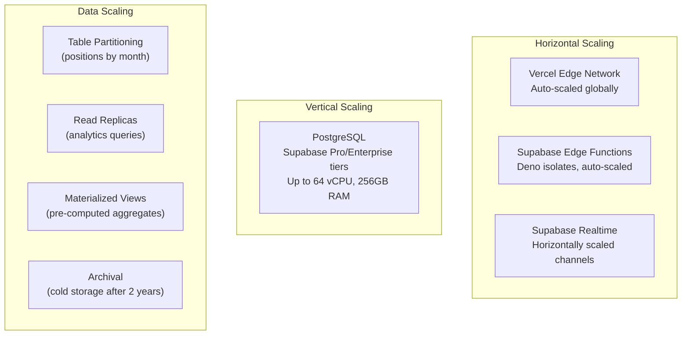
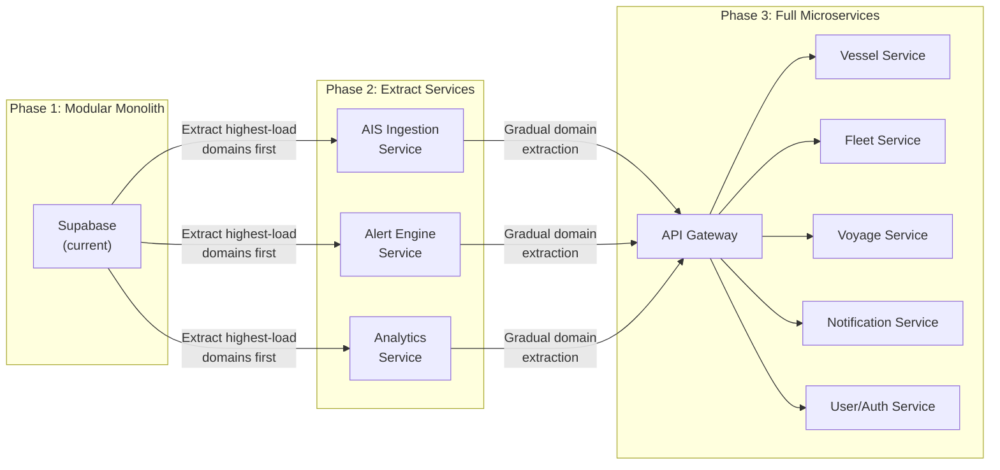

# Part 3 — Security, Performance, Scaling & Migration

---

## 16. Security Architecture

### 16.1 Defense-in-Depth Layers

```
Layer 1: Network — Vercel Edge / Supabase Cloud (DDoS protection, WAF)
Layer 2: Transport — TLS 1.3 everywhere, HSTS, certificate pinning
Layer 3: Authentication — Supabase Auth (JWT, MFA, SSO)
Layer 4: Authorization — RLS policies (row-level), RBAC (role-based)
Layer 5: Input — Zod validation on every API boundary
Layer 6: Data — Encryption at rest (AES-256), field-level for PII
Layer 7: Application — CSP headers, XSS prevention, CSRF tokens
Layer 8: Audit — Comprehensive audit logging
```

### 16.2 Security Headers (Vercel Config)

```json
{
  "headers": [
    {
      "source": "/(.*)",
      "headers": [
        { "key": "Strict-Transport-Security", "value": "max-age=63072000; includeSubDomains; preload" },
        { "key": "X-Content-Type-Options", "value": "nosniff" },
        { "key": "X-Frame-Options", "value": "DENY" },
        { "key": "X-XSS-Protection", "value": "1; mode=block" },
        { "key": "Referrer-Policy", "value": "strict-origin-when-cross-origin" },
        { "key": "Permissions-Policy", "value": "camera=(), microphone=(), geolocation=(self)" },
        { "key": "Content-Security-Policy", "value": "default-src 'self'; script-src 'self'; style-src 'self' 'unsafe-inline' fonts.googleapis.com; img-src 'self' data: blob: *.mapbox.com *.supabase.co; connect-src 'self' *.supabase.co wss://*.supabase.co api.mapbox.com events.mapbox.com; font-src 'self' fonts.gstatic.com; frame-ancestors 'none'" }
      ]
    }
  ]
}
```

### 16.3 API Key Security

```sql
-- API keys stored as hashed values
CREATE TABLE integration.api_keys (
    id              UUID PRIMARY KEY DEFAULT uuid_generate_v4(),
    org_id          UUID NOT NULL REFERENCES org.organizations(id),
    name            TEXT NOT NULL,
    key_prefix      TEXT NOT NULL,            -- first 8 chars (for display: "mt_live_a1b2...")
    key_hash        TEXT NOT NULL,            -- SHA-256 hash of full key
    scopes          TEXT[] DEFAULT '{read}',  -- read | write | admin
    rate_limit      INTEGER DEFAULT 100,      -- req/min
    last_used_at    TIMESTAMPTZ,
    expires_at      TIMESTAMPTZ,
    is_active       BOOLEAN DEFAULT true,
    created_by      UUID REFERENCES auth.users(id),
    created_at      TIMESTAMPTZ DEFAULT now()
);

-- Key format: mt_live_<random 32 chars> or mt_test_<random 32 chars>
-- Full key shown ONLY at creation time, never stored in plaintext
```

### 16.4 Audit Logging

```sql
CREATE TABLE core.audit_log (
    id              UUID PRIMARY KEY DEFAULT uuid_generate_v4(),
    org_id          UUID,
    user_id         UUID,
    action          TEXT NOT NULL,   -- create | update | delete | login | export | invite
    resource_type   TEXT NOT NULL,   -- vessel | fleet | alert | member | settings
    resource_id     UUID,
    changes         JSONB,           -- { field: { old: x, new: y } }
    ip_address      INET,
    user_agent      TEXT,
    created_at      TIMESTAMPTZ DEFAULT now()
);

-- Automatic audit via trigger
CREATE OR REPLACE FUNCTION core.audit_trigger()
RETURNS TRIGGER AS $$
BEGIN
    INSERT INTO core.audit_log (org_id, user_id, action, resource_type, resource_id, changes)
    VALUES (
        COALESCE(NEW.org_id, OLD.org_id),
        auth.uid(),
        TG_OP,
        TG_TABLE_SCHEMA || '.' || TG_TABLE_NAME,
        COALESCE(NEW.id, OLD.id),
        CASE
            WHEN TG_OP = 'UPDATE' THEN jsonb_build_object('old', to_jsonb(OLD), 'new', to_jsonb(NEW))
            WHEN TG_OP = 'DELETE' THEN to_jsonb(OLD)
            ELSE to_jsonb(NEW)
        END
    );
    RETURN COALESCE(NEW, OLD);
END;
$$ LANGUAGE plpgsql SECURITY DEFINER;
```

### 16.5 Rate Limiting

```
Rate Limiting Strategy:
───────────────────────
Layer 1: Vercel Edge — IP-based rate limiting (global)
Layer 2: Supabase — Built-in rate limits on auth endpoints
Layer 3: Edge Functions — Token bucket per API key / user
Layer 4: Database — Connection pooling limits (PgBouncer)

Implementation in Edge Functions:
- Use Supabase KV or a rate_limits table
- Token bucket algorithm: tokens refill per minute
- Headers: X-RateLimit-Limit, X-RateLimit-Remaining, X-RateLimit-Reset
- 429 Too Many Requests with Retry-After header
```

---

## 17. Performance Optimization Architecture

### 17.1 Frontend Performance Budget

| Metric | Target | Technique |
|--------|--------|-----------|
| **FCP** | < 1.2s | Critical CSS inline, preload fonts |
| **LCP** | < 2.0s | Lazy load map, SSG for shell |
| **TTI** | < 3.0s | Code splitting, tree shaking |
| **CLS** | < 0.05 | Fixed layout skeletons |
| **Bundle (initial)** | < 200KB gzipped | Dynamic imports, chunk splitting |
| **Map load** | < 1.5s | Deferred Mapbox init, sprite preload |

### 17.2 Code Splitting Strategy

```typescript
// Route-level code splitting
const MapPage = lazy(() => import('./features/map/pages/MapPage'));
const VesselsPage = lazy(() => import('./features/vessels/pages/VesselsPage'));
const AnalyticsPage = lazy(() => import('./features/analytics/pages/AnalyticsPage'));
const SettingsPage = lazy(() => import('./features/settings/pages/SettingsPage'));

// Component-level splitting for heavy modules
const MapboxMap = lazy(() => import('./features/map/components/MapContainer'));
const ChartDashboard = lazy(() => import('./features/analytics/components/ChartDashboard'));
const GeofenceEditor = lazy(() => import('./features/map/components/GeofenceDrawer'));

// Preload on hover/intent
const preloadMap = () => import('./features/map/pages/MapPage');
<NavLink onMouseEnter={preloadMap} to="/app/map">Map</NavLink>
```

### 17.3 Database Performance

```sql
-- Critical indexes for query performance
CREATE INDEX idx_vessels_org ON vessel.vessels (org_id);
CREATE INDEX idx_vessels_mmsi ON vessel.vessels (mmsi) WHERE mmsi IS NOT NULL;
CREATE INDEX idx_vessels_imo ON vessel.vessels (imo) WHERE imo IS NOT NULL;
CREATE INDEX idx_vessels_name_trgm ON vessel.vessels USING gin (name gin_trgm_ops);

CREATE INDEX idx_positions_vessel_ts ON vessel.positions (vessel_id, timestamp DESC);
CREATE INDEX idx_positions_org_ts ON vessel.positions (org_id, timestamp DESC);
CREATE INDEX idx_positions_geo ON vessel.positions USING gist (location);
CREATE INDEX idx_positions_recent ON vessel.positions (timestamp DESC)
    WHERE timestamp > now() - interval '24 hours';

CREATE INDEX idx_alert_events_org ON alert.events (org_id, created_at DESC);
CREATE INDEX idx_alert_events_unack ON alert.events (org_id)
    WHERE acknowledged = false;

CREATE INDEX idx_geofences_geo ON alert.geofences USING gist (geometry);
CREATE INDEX idx_geofences_org ON alert.geofences (org_id) WHERE is_active = true;

-- Partitioning: positions table by month (for historical data)
-- Use pg_partman or native PARTITION BY RANGE (timestamp)
CREATE TABLE vessel.positions_y2026m01 PARTITION OF vessel.positions
    FOR VALUES FROM ('2026-01-01') TO ('2026-02-01');
```

### 17.4 Rendering Performance

```
Virtual Scrolling:
- Vessel list (1000+ items) → @tanstack/react-virtual
- Alert event log → windowed rendering
- Analytics tables → paginated + virtual

Map Rendering:
- WebGL-based Mapbox GL (GPU-accelerated)
- Canvas-based marker rendering (not DOM nodes)
- requestAnimationFrame for smooth animations
- Debounced source updates (batch every 500ms)
- Web Worker for cluster computation

React Optimizations:
- React.memo on all list items and map overlays
- useMemo / useCallback for expensive computations
- Zustand selectors with shallow equality checks
- Suspense boundaries with skeleton loaders
```

---

## 18. Scaling Architecture

### 18.1 Scaling Dimensions



### 18.2 Scale Targets

| Metric | Phase 1 (MVP) | Phase 2 | Phase 3 (Enterprise) |
|--------|:------------:|:-------:|:-------------------:|
| Organizations | 50 | 500 | 5,000+ |
| Concurrent users | 200 | 2,000 | 20,000+ |
| Tracked vessels | 5,000 | 50,000 | 500,000+ |
| Positions/day | 1M | 50M | 1B+ |
| Position storage | 10GB | 500GB | 10TB+ |
| API requests/min | 1,000 | 10,000 | 100,000+ |
| WebSocket connections | 200 | 5,000 | 50,000+ |

### 18.3 Data Lifecycle & Archival

```
Hot Data (PostgreSQL primary):
  └── Last 30 days of positions
  └── All active entities

Warm Data (Read replica):
  └── 30 days – 1 year of positions
  └── Analytics aggregations

Cold Data (S3 / Supabase Storage):
  └── 1+ year old positions (Parquet format)
  └── Audit logs > 1 year
  └── Accessible via Edge Function on-demand

Archival Policy:
  └── Positions > 2 years: compressed, moved to cold storage
  └── Aggregated summaries retained indefinitely
  └── GDPR: full purge capability per organization
```

### 18.4 Connection Pooling

```
Supabase uses PgBouncer for connection pooling:
  - Transaction mode (default): connections returned after each transaction
  - Session mode: for long-lived connections (Realtime)

Configuration recommendations:
  - Pro tier: 100 direct + 200 pooled connections
  - Enterprise: 500 direct + 1000 pooled connections
  - Edge Functions use pooled connections exclusively
  - Realtime uses dedicated connection pool
```

---

## 19. Future Microservices Migration Strategy

### 19.1 Migration Phases



### 19.2 Extraction Criteria

A domain should be extracted to a standalone service when:

1. **Scale divergence** — It needs to scale independently (e.g., AIS ingestion at 100K msg/min)
2. **Team ownership** — A dedicated team owns the domain
3. **Technology mismatch** — It would benefit from a different runtime (e.g., Rust for AIS decoding)
4. **Deployment cadence** — It needs faster release cycles than the monolith
5. **Fault isolation** — Failures should not cascade to other domains

### 19.3 Extraction Playbook

```
For each domain extraction:
──────────────────────────
1. Ensure clean domain boundaries in current codebase
   - No cross-schema joins (use API calls)
   - Clear interface contracts (TypeScript types)

2. Create standalone service
   - Own database (or schema with own connection)
   - Own deployment pipeline
   - Own monitoring and alerts

3. Implement synchronous bridge
   - Edge Function proxies to new service
   - Same API contract, different implementation

4. Migrate data
   - Dual-write period
   - Background sync
   - Validation phase

5. Cut over
   - Route traffic to new service
   - Deprecate old Edge Function
   - Remove old schema after validation period

Communication Patterns:
   - Sync: REST/gRPC between services
   - Async: Message queue (NATS / CloudEvents)
   - Events: Change Data Capture from PostgreSQL
```

### 19.4 Technology Upgrade Path

| Component | Current | Future Option | Trigger |
|-----------|---------|---------------|---------|
| AIS Ingestion | Edge Functions (Deno) | Rust service on Fly.io/Railway | >50K msg/min |
| Message Queue | pg_cron + tables | NATS / Redis Streams | >10 async event types |
| Search | pg_trgm | Typesense / Meilisearch | >100K vessels |
| Analytics | Materialized Views | ClickHouse / TimescaleDB | >1B positions |
| Cache | TanStack Query + MVs | Redis / Upstash | >5K concurrent users |
| API Gateway | PostgREST + Edge Fn | Kong / custom gateway | Multi-service routing |
| Auth | Supabase Auth | Auth0 / custom JWT | Enterprise SSO needs |
| File Storage | Supabase Storage | Cloudflare R2 | >1TB stored |

---

## 20. Environment Management Strategy

### 20.1 Environment Tiers

```
┌──────────────────────────────────────────────┐
│ Production    │ vercel.com (main branch)      │
│               │ supabase.com (prod project)   │
│               │ marinetrack.io                │
├──────────────────────────────────────────────┤
│ Staging       │ vercel.com (staging branch)   │
│               │ supabase.com (staging project)│
│               │ staging.marinetrack.io        │
├──────────────────────────────────────────────┤
│ Development   │ vercel.com (dev branch)       │
│               │ supabase local (Docker)       │
│               │ localhost:5173                │
├──────────────────────────────────────────────┤
│ Preview       │ vercel.com (per PR)           │
│               │ supabase branching (beta)     │
│               │ pr-123.marinetrack.io         │
└──────────────────────────────────────────────┘
```

### 20.2 Environment Variables

```bash
# .env.local (development)
VITE_SUPABASE_URL=http://localhost:54321
VITE_SUPABASE_ANON_KEY=eyJ...local
VITE_MAPBOX_TOKEN=pk.test_...
VITE_APP_ENV=development
VITE_ENABLE_DEVTOOLS=true
VITE_AIS_MOCK=true

# .env.staging
VITE_SUPABASE_URL=https://staging-xxx.supabase.co
VITE_SUPABASE_ANON_KEY=eyJ...staging
VITE_MAPBOX_TOKEN=pk.staging_...
VITE_APP_ENV=staging
VITE_SENTRY_DSN=https://...@sentry.io/staging

# .env.production
VITE_SUPABASE_URL=https://prod-xxx.supabase.co
VITE_SUPABASE_ANON_KEY=eyJ...prod
VITE_MAPBOX_TOKEN=pk.prod_...
VITE_APP_ENV=production
VITE_SENTRY_DSN=https://...@sentry.io/prod

# Server-side secrets (Vercel env vars, never in .env files)
SUPABASE_SERVICE_ROLE_KEY=eyJ...
STRIPE_SECRET_KEY=sk_live_...
SENDGRID_API_KEY=SG...
AIS_PROVIDER_API_KEY=...
```

### 20.3 CI/CD Pipeline

```
GitHub Actions Pipeline:
────────────────────────
Pull Request:
  1. Lint (ESLint + Prettier)
  2. Type check (tsc --noEmit)
  3. Unit tests (Vitest)
  4. Build check (vite build)
  5. Vercel preview deployment
  6. Supabase migration dry-run
  7. Lighthouse CI (performance budget check)

Merge to main:
  1. All PR checks pass
  2. Supabase migration apply (production)
  3. Vercel production deployment
  4. Smoke tests (Playwright)
  5. Sentry release + source maps upload
  6. Slack notification
```

### 20.4 Monitoring & Observability

```
Frontend:
  - Sentry: Error tracking, performance monitoring, session replay
  - Vercel Analytics: Web vitals, page load times
  - Custom: WebSocket health dashboard

Backend:
  - Supabase Dashboard: Query performance, connection stats
  - pg_stat_statements: Slow query identification
  - Edge Function logs: Supabase Logs Explorer
  - Custom: alert.events table for domain monitoring

Alerting:
  - PagerDuty / Opsgenie for critical failures
  - Slack for warnings and deployments
  - Email for daily digest
```
